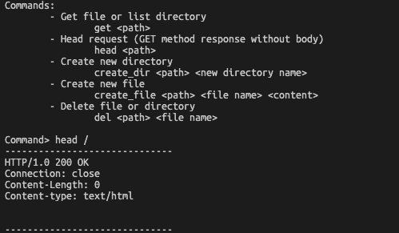
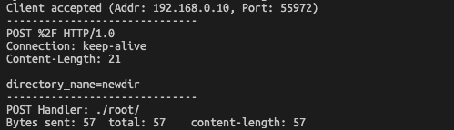

# socket-HTTP

## Table of Contents

- [1. 개요](#1-개요)
- [2. 개발환경](#2-개발환경)
- [3. 사용](#3-사용)
  - [3.1. 서버 컴파일](#31-서버-컴파일)
  - [3.2. 클라이언트 컴파일](#32-클라이언트-컴파일)
- [4. 서버 API](#4-서버-API)
  - [4.1. GET \<path>](#41-GET-<path>)
  - [4.2. HEAD \<path>](#42-HEAD-<path>)
  - [4.3. POST \<path>](#43-POST-<path>)
  - [4.4. PUT \<path>](#44-PUT-<path>)
  - [4.5. DELETE \<path>](#45-DELETE-<path>)
- [5. 동작 결과](#5-동작-결과)
  - [5.1. CLI client](#51-CLI-client)
  - [5.2. Chrome Web browser client](#52-Chrome-Web-browser-client)
  - [5.3. WireShark 캡쳐](#53-WireShark-캡쳐)
- [6. 주요 구현내용 및 작동 방식](#6-주요-구현내용-및-작동-방식)
  - [6.1. 프로젝트 구조](#61-프로젝트-구조)
  - [6.2. 헤더파일](#62-헤더파일)
  - [6.3. 템플릿 파일](#63-템플릿-파일)
  - [6.4. 서버 및 클라이언트](#64-서버-및-클라이언트)

## 1. 개요

C++ socket programming을 이용하여 제작한 HTTP 기반의 파일 서버, 기본적인 디렉토리 탐색, 폴더 생성, 파일 제거, 파일 업로드 등의 기능 제공

## 2. 개발환경

- C++20
- g++ Apple clang version 13.1.6 (clang-1316.0.21.2.3)
- Mac OS v12.3.1

## 3. 사용

### 3.1. 서버 컴파일

```
g++ -std=c++20 server.cpp -o server.o
```

### 3.2. 클라이언트 컴파일

```
g++ -std=c++20 client.cpp -o client.o
```

## 4. 서버 API

### 4.1. GET \<path>

- \<path>가 `/`로 끝날 경우 해당 디렉토리 정보 반환
- \<path>가 `/`로 끝나지 않을 경우 해당 파일 반환

#### Request Example

```
GET / HTTP/1.0
Connection: keep-alive
Cache-Control: max-age=0
Upgrade-Insecure-Requests: 1
User-Agent: Mozilla/5.0 (Macintosh; Intel Mac OS X 10_15_7) AppleWebKit/537.36 (KHTML, like Gecko) Chrome/100.0.4896.127 Safari/537.36
Accept: text/html,application/xhtml+xml,application/xml;q=0.9,image/avif,image/webp,image/apng,*/*;q=0.8,application/signed-exchange;v=b3;q=0.9
Accept-Encoding: gzip, deflate
Accept-Language: ko-KR,ko;q=0.9,en-US;q=0.8,en;q=0.7

```

#### Response Structure

```
HTTP/1.0 200 OK
Connection: close
Content-Length: 0
Content-type: text/html

<디렉토리 정보 표현한 HTML>
```

```
HTTP/1.0 200 OK
Connection: close
Content-Length: <파일 크기>
Content-type: text/plain

<파일 내용>
```

### 4.2. HEAD \<path>

- 주어진 \<path>에 대한 GET 메소드 요청의 반환 결과에서 header만 반환

#### Request Example

```
HEAD / HTTP/1.0
Connection: keep-alive
Cache-Control: max-age=0
Upgrade-Insecure-Requests: 1
User-Agent: Mozilla/5.0 (Macintosh; Intel Mac OS X 10_15_7) AppleWebKit/537.36 (KHTML, like Gecko) Chrome/100.0.4896.127 Safari/537.36
Accept: text/html,application/xhtml+xml,application/xml;q=0.9,image/avif,image/webp,image/apng,*/*;q=0.8,application/signed-exchange;v=b3;q=0.9
Accept-Encoding: gzip, deflate
Accept-Language: ko-KR,ko;q=0.9,en-US;q=0.8,en;q=0.7

```

#### Response Structure

```
HTTP/1.0 200 OK
Connection: close
Content-Length: 0
Content-type: text/html
```

### 4.3. POST \<path>

- 주어진 디렉토리 \<path>에 새로운 디렉토리 생성

#### Body parameters

| Parameter        | Description               |
| ---------------- | ------------------------- |
| `directory_name` | 새로 생성할 디렉토리 이름 |

#### Request Example

```
POST / HTTP/1.0
Connection: keep-alive
Content-Length: 19
Accept: */*
X-Requested-With: XMLHttpRequest
User-Agent: Mozilla/5.0 (Macintosh; Intel Mac OS X 10_15_7) AppleWebKit/537.36 (KHTML, like Gecko) Chrome/100.0.4896.127 Safari/537.36
Content-Type: application/x-www-form-urlencoded; charset=UTF-8
Accept-Encoding: gzip, deflate
Accept-Language: ko-KR,ko;q=0.9,en-US;q=0.8,en;q=0.7

directory_name=test
```

#### Response Structure

```
HTTP/1.0 200 OK
Connection: close
Content-Length: 0
```

### 4.4. PUT \<path>

- 주어진 디렉토리 \<path>에 파일 업로드

#### Body parameters

| Parameter | Description            |
| --------- | ---------------------- |
| `file`    | base64로 인코딩된 파일 |
| `name`    | 저장될 파일 이름       |

#### Request Example

```
PUT / HTTP/1.0
Connection: keep-alive
Content-Length: 5554467
Accept: */*
X-Requested-With: XMLHttpRequest
User-Agent: Mozilla/5.0 (Macintosh; Intel Mac OS X 10_15_7) AppleWebKit/537.36 (KHTML, like Gecko) Chrome/100.0.4896.127 Safari/537.36
Content-Type: application/x-www-form-urlencoded; charset=UTF-8
Accept-Encoding: gzip, deflate
Accept-Language: ko-KR,ko;q=0.9,en-US;q=0.8,en;q=0.7

file=JVBERi0xLjUKJY8KNSAwIG9iago8PCAvVHlwZSAvT2JqU3RtIC9GaWx0ZXIgL0ZsYXRlRGVjb2RlIC9GaXJzdCA4MTQgL0xlbmd0aCAxNjc0IC9OIDEwMCA%2BPgpzdHJlYW0KeNrNWF1P20oQffevmMf2AWe%2FvB8SqhSgYCR6W5Xq8tDyYBIXrCZ25Dht6a%2B%2FZ%2BI1AS4Q2qvqVm2YtXfn7JmZs2uvDQnypAUFMo6kIoe%2FGo2MpCWZwThSQuJHSsPgv1WkDKmgEozSAv1A0DCBtMVPkQ4wmgwgtCUDZHQbi58gEzw6KAOYMZRZlZiMsoArT1Yp9JN1uAMqwmIYOcvDyAXcdOQxpwVn%2FKykIHBlKBiR2IyCx5UnKUAWRKRAME6RlBwXgpKY1yEqiT8cpwIrL2AxyEvEjQm9gTUyAZTULpAHnpGYEHjGIU%2FAyzBrAF6G4AJnyYEJ8DgKKQ...<생략>&name=test.pdf
```

#### Response Structure

```
HTTP/1.0 200 OK
Connection: close
Content-Length: 0
```

### 4.5. DELETE \<path>

- 주어진 디렉토리 \<path>에 있는 파일 또는 디렉토리 삭제

#### Body parameters

| Parameter   | Description                    |
| ----------- | ------------------------------ |
| `file_name` | 삭제할 파일 또는 디렉토리 이름 |

#### Request Example

```
DELETE / HTTP/1.0
Connection: keep-alive
Content-Length: 14
Accept: */*
X-Requested-With: XMLHttpRequest
User-Agent: Mozilla/5.0 (Macintosh; Intel Mac OS X 10_15_7) AppleWebKit/537.36 (KHTML, like Gecko) Chrome/100.0.4896.127 Safari/537.36
Content-Type: application/x-www-form-urlencoded; charset=UTF-8
Accept-Encoding: gzip, deflate
Accept-Language: ko-KR,ko;q=0.9,en-US;q=0.8,en;q=0.7

file_name=test
```

#### Response Structure

```
HTTP/1.0 200 OK
Connection: close
Content-Length: 0
```

## 5. 동작 결과

### 5.1. CLI client

| Method | Response code | server                                          | cli client                                      | 비고                                                                         |
| ------ | ------------- | ----------------------------------------------- | ----------------------------------------------- | ---------------------------------------------------------------------------- |
| GET    | 200           |   |   | `/` 디렉토리 정보 출력 요청                                                  |
| HEAD   | 200           |  |  | `/` GET 요청에 대한 HEAD요청                                                 |
| POST   | 200           |  |  | `/` 디렉토리에 `newdir` 이름의 디렉토리 생성                                 |
| PUT    | 200           |   |   | `/newdir/` 디렉토리에 `testfile`이라는 텍스트가 담긴 `newfile.txt` 파일 생성 |
| GET    | 200           |   |   | `/newdir/newfile.txt` 파일 요청                                              |
| GET    | 200           |   |   | `/newdir/` 디렉토리 정보 출력 요청                                           |
| DELETE | 200           |   |   | `/newdir/` 디렉토리 삭제 요청                                                |
| GET    | 404           |   |   | `/newdir/` 디렉토리 정보 출력 요청, 하지만 앞서 제거했기 때문에 404에러 반환 |

### 5.2. Chrome Web browser client

| Method | Response code | server                                    | Chrome client                             | 비고                                                        |
| ------ | ------------- | ----------------------------------------- | ----------------------------------------- | ----------------------------------------------------------- |
| GET    | 200           |  |  | `/` 디렉토리 조회                                           |
| POST   | 200           |  |  | `/` 디렉토리에 `새 폴더 입니다` 이름의 디렉토리 생성 요청   |
| GET    | 200           |  |  | `/` 디렉토리 조회                                           |
| GET    | 200           |  |  | `/새 폴더 입니다/` 디렉토리 조회                            |
| PUT    | 200           |  |  | `/새 폴더 입니다/` 디렉토리에 PDF파일 업로드                |
| GET    | 200           |  |  | `/새 폴더 입니다/` 디렉토리 조회                            |
| GET    | 200           |  |  | `/새 폴더 입니다/` 디렉토리의 PDF파일 요청                  |
| PUT    | 200           |  |  | `/새 폴더 입니다/` 디렉토리에 이미지 파일 업로드            |
| GET    | 200           |  |  | `/새 폴더 입니다/` 디렉토리 조회                            |
| GET    | 200           |  |  | `/새 폴더 입니다/` 디렉토리의 이미지파일 요청               |
| PUT    | 200           |  |  | `/새 폴더 입니다/` 디렉토리에 HTML파일 업로드               |
| GET    | 200           |  |  | `/새 폴더 입니다/` 디렉토리 조회                            |
| GET    | 200           |  |  | `/새 폴더 입니다/` 디렉토리의 HTML 파일 요청                |
| PUT    | 200           |  |  | `/새 폴더 입니다/` 디렉토리에 영상 파일 업로드              |
| GET    | 200           |  |  | `/새 폴더 입니다/` 디렉토리 조회                            |
| GET    | 200           |  |  | `/새 폴더 입니다/` 디렉토리의 영상 파일 요청                |
| DELETE | 200           |  |  | `/새 폴더 입니다/` 디렉토리의 HTML파일 삭제 요청            |
| GET    | 200           |  |  | `/새 폴더 입니다/` 디렉토리 조회                            |
| GET    | 404           |  |  | `/새 폴더 입니다/` 디렉토리에서 앞서 삭제했던 HTML파일 요청 |

### 5.3. WireShark 캡쳐

| Method | Response code | WireShark                              |
| ------ | ------------- | -------------------------------------- |
| GET    | 200           |     |
| GET    | 404           |     |
| POST   | 200           |    |
| PUT    | 200           |     |
| DELETE | 200           |  |

## 6. 주요 구현내용 및 작동 방식

### 6.1. 프로젝트 구조

```
src/
├─ include/
│  ├─ base64.h -- Base64 인코딩 및 디코딩
│  ├─ urlencode.h -- URL 인코딩 및 디코딩
│  ├─ http.h -- HTTP 메시지 디코딩(파싱) 및 인코딩(메시지 구성)
├─ lib/
│  ├─ fmt/ -- C++ FMT 라이브러리
├─ root/ -- HTTP 파일 서버에서 사용할 root 디렉토리
├─ templates/
│  ├─ directory.html -- 디렉토리 정보 반환에 사용되는 HTML파일
│  ├─ error.html -- 에러 코드 반환에 사용되는 HTML파일
├─ server.cpp -- 서버 소스코드
├─ client.cpp -- 클라이언트 소스코드

```

### 6.2. 헤더파일

#### base64.h

```cpp
static std::string base64Encode(const std::string &in); // 주어진 문자열 `in`에 대한 Base 64 인코딩된 문자열 반환
static std::string base64Decode(const std::string &in); // 주어진 문자열 `in`에 대한 Base 64 디코딩된 문자열 반환
```

#### urlencode.h

```cpp
std::string urlEncode(std::string str); // 주어진 문자열 `str`에 대한 url 인코딩된 문자열 반환
std::string urlDecode(std::string str); // 주어진 문자열 `str`에 대한 url 디코딩된 문자열 반환
```

#### http.h

```cpp
// HTTP 요청 메시지 처리를 위한 클래스
class HTTPRequest
{
public:
  std::string method; // 요청 Method를 담고 있는 문자열
  std::string URL; // 요청 URL를 담고 있는 문자열
  std::map<std::string, std::string> url_params; // 요청 URL 파라미터의 key, value값을 담고 있는 map 객체
  std::string version; // 버전 정보를 담고 있는 문자열
  std::map<std::string, std::string> headers; // 요청 헤더의 key, value값을 담고 있는 map 객체
  std::string body; // 요청 body를 담고 있는 문자열

  HTTPRequest(); // 기본 생성자
  HTTPRequest(std::string req_message); // 주어진 요청 메시지 문자열 `req_message`을 파싱하는 생성자

  void clear(); // 객체 초기화하는 메소드
  void parseRequestMessage(std::string req_message); // 주어진 요청 메시지 문자열 `req_message`을 파싱하는 메소드
  std::map<std::string, std::string> parseBody(); // Body를 파싱하여 map 객체로 반환하는 메소드
  std::string toMessage(); // 현재 객체가 가지고 있는 정보를 요청 메시지 문자열로 구성하여 반환하는 메소드
};

// HTTP 응답 메시지 처리를 위한 클래스
class HTTPResponse
{
public:
  std::string protocol; // 응답 Protocol 정보를 담고 있는 문자열
  std::string status_code; // 응답 status code를 담고 있는 문자열
  std::string status_phrase; // 응답 status 문구를 담고 있는 문자열
  std::map<std::string, std::string> headers; // 응답 헤더의 key, value값을 담고 있는 map 객체
  std::string body; // 응답 body를 담고 있는 문자열

  HTTPResponse(); // 기본 생성자
  HTTPResponse(std::string res_message); // 주어진 응답 메시지 문자열 `res_message`을 파싱하는 생성자

  void clear(); // 객체 초기화하는 메소드
  void parseResponseMessage(std::string res_message); // 주어진 응답 메시지 문자열 `res_message`을 파싱하는 메소드
  std::string toMessage(); // 현재 객체가 가지고 있는 정보를 응답 메시지 문자열로 구성하여 반환하는 메소드
};
```

### 6.3. 템플릿 파일

#### directory.html

- 웹 브라우저에서 접속했을 때, 디렉토리 요청 시 HTML파일을 구성해주기 위한 템플릿 파일. 삭제(DELETE)/새 디렉토리(POST)/파일 업로드(PUT) 명령을 수행하기 위한 javascript도 포함
- 다음의 지정된 문자를 포함하고 있다
  - `{{title}}`: HTML페이지의 타이틀로 서버에서 replace 처리됨
  - `{{header}}`: HTML페이지의 최상단에 위치할 텍스트로, 서버에서 replace 처리됨
  - `{{content}}`: HTML페이지의 테이블 형태로 디렉토리 내의 파일/폴더 정보를 출력, 서버에서 replace 처리됨
- 메타태그
  - `<meta charset="UTF-8" />`
  - `<meta name="viewport" content="width=device-width, initial-scale=1.0">`
    - 모바일 기기의 가로 크기에 맞추기 위함
- CSS
  - `<link rel="stylesheet" href="https://cdn.simplecss.org/simple.min.css" />`
    - Simple.css를 사용
- 외부 js script
  - `<script src="https://kit.fontawesome.com/e286ff9e3b.js" crossorigin="anonymous"></script>`
    - 아이콘 사용하기 위함
  - `<script src="https://ajax.googleapis.com/ajax/libs/jquery/3.6.0/jquery.min.js"></script>`
    - jQuery

#### error.html

- 웹 브라우저에서 접속했을 때, 에러 메시지를 출력할 HTML파일을 구성해주기 위한 템플릿 파일
- 다음의 지정된 문자를 포함하고 있다
  - `{0}`: C++ fmt 라이브러리에 의해 status code로 대체될 문자
  - `{1}`: C++ fmt 라이브러리에 의해 status 문구로 대체될 문자
  - `{2}`: C++ fmt 라이브러리에 의해 에러 메시지로 대체될 문자

### 6.4. 서버 및 클라이언트

#### Multi-processing 형태의 요청 처리 방식

서버가 요청을 처리할 때, single process로 처리할 경우 다음과 같은 문제가 발생할 수 있다.

- 단 하나의 요청에 대해서 런타임 에러가 발생하더라도 서버 자체가 중단될 수 있음
- 한 클라이언트의 요청 처리 시간이 길 경우 다른 클라이언트의 요청에 대해서는 응답할 수 없음

이러한 문제를 해결하기 위해 새로운 클라이언트와 연결이 체결된 후, `fork()` 시스템 호출을 하여 새로운 프로세스에서 해당 요청을 처리하도록 구현했다.

#### 메시지 전송 및 수신 방식

소켓 명령어인 `read`와 `send`를 사용하여 메시지를 송수신할 수 있다. 하지만 송수신 최대 길이에 제한이 있기 때문에 단 한번의 `read` 또는 `send` 명령으로 큰 파일에 대한 요청은 처리할 수 없다. 이를 해결하고자 `MAX_RECV_SIZE`, `MAX_SEND_SIZE` 두 값을 설정하고 해당 값에 맞추어 메시지를 나눈 뒤에 여러번 `read` 또는 `send` 명령을 수행하도록 했다.

- 메시지 수신 방식

  1. 요청 헤더의 최대 길이인 `MAX_HEADER_SIZE` 만큼 읽는다.
  2. 수신한 헤더 정보를 파싱하여 헤더에서 body의 길이 정보인 `Content-Length`을 얻는다.
  3. `MAX_RECV_SIZE` 만큼 수신하며 수신된 메시지의 길이가 `Content-Length`가 될 때까지 반복한다.

- 메시지 전송 방식
  1. 전송할 메시지를 `MAX_SEND_SIZE` 단위로 쪼갠 뒤, 여러번 `send`를 수행하여 모두 전송한다.

#### server.cpp

```cpp
#define ADDRESS "192.168.0.10" // 생성할 서버 주소
#define PORT 1234 // 생성할 서버 포트
#define MAX_HEADER_SIZE 8192 // 요청 받을 메시지의 헤더 최대 길이
#define MAX_RECV_SIZE 8192 // 메시지 수신 chunk의 최대 길이
#define MAX_SEND_SIZE 8192 // 메시지 전송 chunk의 최대 길이
#define MAX_CONNECTION 10 // 동시 접속 개수

const std::string ROOT_DIRECTORY = "./root"; // 파일 서버에서 사용할 루트 디렉토리 경로

std::string currentDirectory(std::string path); // 경로 정보 `path`가 속해있는 디렉토리 반환
std::string readFile(std::string filepath); // 파일의 경로 정보 `filepath`에 해당하는 파일을 읽고 반환
std::string getType(std::string filepath); // 파일의 경로 정보 `filepath`에 해당하는 파일의 형식을 반환 (png, jpeg, pdf, ...)
std::string parsePath(std::string url); // 요청 URL인 `url`을 실제 파일 경로로 변환하여 반환

HTTPResponse requestHandler(char *buffer); // 요청 메시지 문자열 `buffer`를 받고 적절한 응답 객체 반환
HTTPResponse methodHandler(HTTPRequest &request); // 요청 객체 `request`를 받고 적절한 응답 객체 반환
HTTPResponse getHandler(HTTPRequest &request); // 요청 객체 `request`를 받고 GET method에 해당되는 응답 객체 반환
HTTPResponse headHandler(HTTPRequest &request); // 요청 객체 `request`를 받고 HEAD method에 해당되는 응답 객체 반환
HTTPResponse postHandler(HTTPRequest &request); // 요청 객체 `request`를 받고 POST method에 해당되는 응답 객체 반환
HTTPResponse deleteHandler(HTTPRequest &request); // 요청 객체 `request`를 받고 DELETE method에 해당되는 응답 객체 반환
HTTPResponse putHandler(HTTPRequest &request); // 요청 객체 `request`를 받고 PUT method에 해당되는 응답 객체 반환
HTTPResponse errorResponse(std::string error_code, std::string error_phrase, std::string error_message); // 에러 코드, 에러 phrase, 에러 메시지를 받고 해당되는 에러 응답 객체를 생성하여 반환

```

#### client.cpp

```cpp
#define ADDRESS "192.168.0.10" // 접속할 서버 주소
#define PORT 1234 // 접속할 서버 포트
#define MAX_RECV_SIZE 8192 // 메시지 수신 chunk의 최대 길이
#define MAX_SEND_SIZE 8192 // 메시지 전송 chunk의 최대 길이

int getSocket(const char *address, const int port); // 주어진 주소 및 포트에 해당되는 서버에 TCP 접속 시도 후 socket반환

HTTPRequest requestGET(std::string url); // 주어진 URL인 `url`에 대한 GET method 요청 객체를 반환
HTTPRequest requestHEAD(std::string url); // 주어진 URL인 `url`에 대한 HEAD method 요청 객체를 반환
HTTPRequest requestPOST(std::string url, std::string directory_name); // 주어진 URL인 `url`과 새로 생성할 디렉토리 이름 `directory_name`에 대한 POST method 요청 객체를 반환
HTTPRequest requestDELETE(std::string url, std::string file_name); // 주어진 URL인 `url`과 제거할 파일 또는 디렉토리 이름 `file_name`에 대한 DELETE method 요청 객체를 반환
HTTPRequest requestPUT(std::string url, std::string file_name, std::string file_content); // 주어진 URL인 `url`과 새로 생성할 파일 이름 `file_name` 그리고 파일 내용 `file_content`에 대한 PUT method 요청 객체를 반환
```
